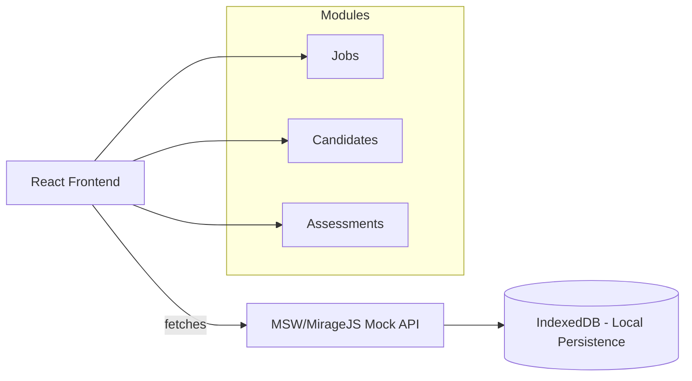

# 🌟 TalentFlow – A Mini Hiring Platform

TalentFlow is a **React-based front-end application** that simulates a mini hiring platform for HR teams.  
It allows HR managers to manage **Jobs, Candidates, and Assessments** in an interactive, modern, and responsive interface.  
This project is **front-end only** with simulated APIs and local persistence.

---

## 🚀 Features

### 🔹 Jobs Management
- Create, edit, archive/unarchive jobs  
- Reorder jobs via drag-and-drop with optimistic updates & rollback  
- Deep linking: `/jobs/:jobId`  
- Validation (title required, unique slug)  

### 🔹 Candidates
- Virtualized list for 1000+ candidates  
- Client-side search & server-like filters  
- Candidate profile with timeline `/candidates/:id`  
- Kanban board to move candidates between stages  
- Notes with @mentions  

### 🔹 Assessments
- Assessment builder (single-choice, multi-choice, text, numeric, file upload stub)  
- Live preview pane & runtime validation  
- Conditional questions  
- Candidate responses persisted locally  

### 🔹 Data Layer
- **Simulated REST API** with MSW/MirageJS  
- **Persistence in IndexedDB** (via Dexie/localForage)  
- Artificial latency & error rate for real-world feel  

---
# Setup & Installation
## Clone the repository
```bash
git clone https://github.com/username/talentflow.git
cd talentflow
```
## Install dependencies
```bash
npm install
```
## Start development server
```bash
npm run dev
```

## 🏗️ Architecture


## ⚠️ Known Issues / Limitations

- 🔄 **Job Reordering:**  
  Drag-and-drop reordering only works reliably when moving jobs **upwards**.  
  Moving jobs **downwards** currently does not reorder as expected.  
- 🐢 **Kanban Board Performance:**  
  The Kanban board becomes **sluggish with large datasets (1000+ candidates)**.  
  Optimization (e.g., virtualization, lazy-loading) is needed to improve performance.  
---

## 🧠 Technical Decisions

- **Framework – Next.js**  
  Chosen for file-based routing, optimized builds, and easy deployment on Vercel.  

- **UI & Styling**  
  Tailwind CSS for fast, utility-first styling. Reusable components for consistency.  

- **State Management**  
  React Query for server-like state (API caching, optimistic updates).  
  Zustand for lightweight UI state (filters, modals, drag state).  

- **Persistence & Mock API**  
  IndexedDB (via Dexie) to store jobs, candidates, and assessments locally.  
  MSW/MirageJS used to simulate APIs with latency and error injection.  

- **Drag & Drop**  
  dnd-kit for reordering and Kanban movement with optimistic UI + rollback.  
  (⚠️ Current issue: upward reordering has a bug).  

- **Performance**  
  Candidate lists virtualized (react-window) to handle 1000+ entries.  
  Kanban is slower with large datasets — future optimization planned.  

- **Forms & Assessments**  
  React Hook Form used for validation, conditional logic, and live preview.  

- **Deployment**  
  Vercel for seamless Next.js hosting and preview builds.  
